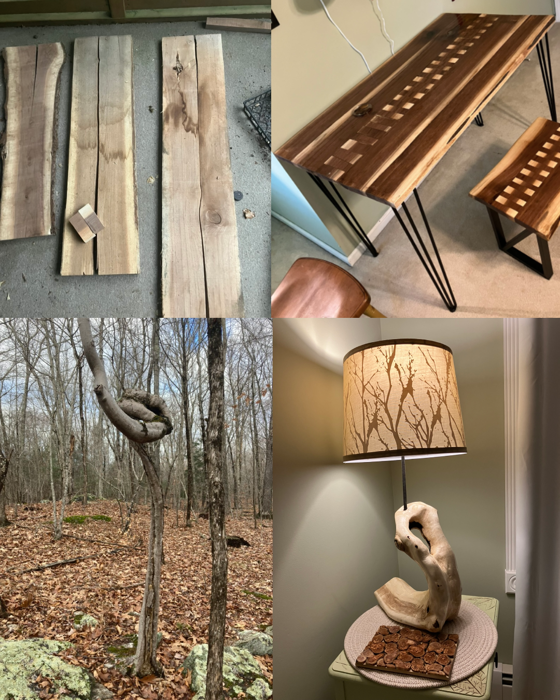

<h1 align="center"> Travelers, let's make this happen! </h1>

---

  <a href="https://jackbienvenue.github.io/Travelers_Interview/" style="font-size: 24px;"><strong>VIEW INTERVIEW SLIDESHOW</strong></a>

---

<h3 align="center", style="font-size: 20px;"><strong>Repository Description
</h3>

Content to share with Traveler's Business Insights &amp; Analytics Internship Hiring Committee speaking to qualifications for the role.

---

<table>
  <tr>
    <td>
      

        <strong>Jack Bienvenue</strong> is an M.S. in Statistics Student at the University of Connecticut. The youngest graduate of UConn's Class of 2025, Jack learned rapidly to understand both statistics and the practice of data science.  
        Jack is unafraid of <em>tough</em> projects. He recently learned how to use UConn's High Performance Computing cluster to build a CSV data set of 40+ years of hourly weather data across 200+ locations in Connecticut from tricky GRIB meteorological files, all to manually code a new statistical model for power outage prediction for Connecticut's towns.  
        Seasoned in Python, R, SQL, LaTeX, markdown, and more skills, Jack knows he can get around very well in a corporate analytics environment.
      

    </td>
    <td>
      
    </td>
  </tr>
</table>

Jack is eager to share his love of data science with Travelers and intends to use the Business Insights and Analytics Leadership Development internship opportunity to springboard a lasting, rewarding career with Travelers.

<table>
  <tr>
    <td>
      
    </td>
    <td>
      

        In his spare time, Jack enjoys hiking, kayaking, golf, and carpentry, upcycling undesirable wood into custom woodworking designs. He also enjoys trying out new programming projects. 

        Spatial data science is Jack's specialty. He has experience in numerous spatial analytical projects, from building machine learning classifiers to identify solar panels from aerial imagery, to discerning whether the value of Connecticut's coastal real estate has been impacted by climate change risks relative to inland real estate, to geographically-specific power outage damage prediction from weather variables, to improving outage prediction model inputs using ultra-high spatiotemporal resolution forecasting and geostatistical methods.
      

    </td>
  </tr>
</table>

**Thank you so much for your consideration. I hope to join Travelers this coming summer!**

---
Copyright - 2025, Jack Bienvenue. All rights reserved for original material.

This material is for review only, and may not be reproduced. This material may not be redistributed beyond use for the hiring process of the Travelers BI&A Leadership Development Internship.

---
All content herein is orignal material, except:

- Traveler's Logo (docs/images/travelers.png)